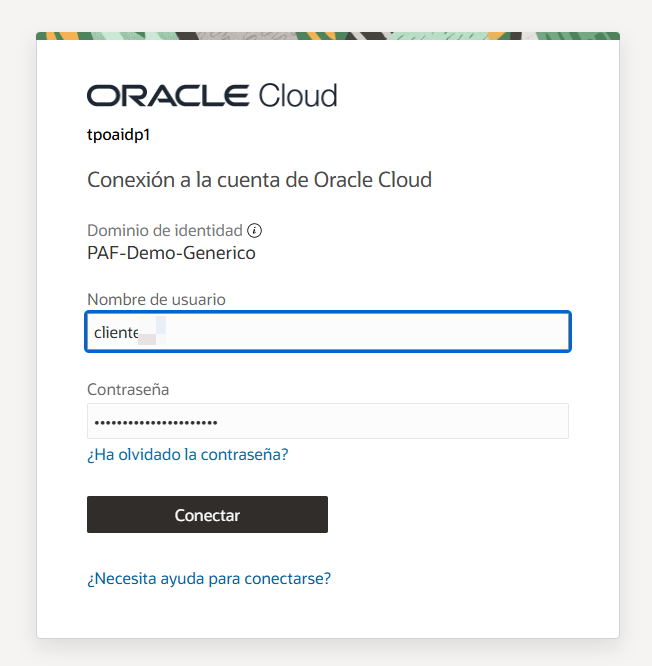
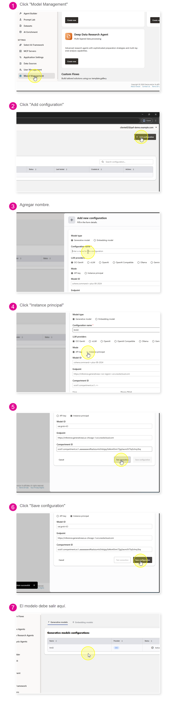

# Ingreso a la cuenta

Esta guía describe cómo acceder a **Oracle AI Database Private Agent Factory (PAF)** y conocer las opciones iniciales de la plataforma.

## Paso 1: Abrir un navegador compatible

Abre un navegador actualizado, como Chrome, Edge o Firefox. Verifica que las cookies y JavaScript estén habilitados.

## Paso 2: Abrir PAF

Ingresa en el navegador la URL de PAF. Su estructura es similar a la siguiente:

```text
https://<direccion-de-paf>/agentFactory/
```

Si el acceso requiere una red corporativa o VPN, conéctate a ella antes de abrir la URL.

## Paso 3: Ingresar las credenciales de Oracle Cloud

Según la configuración del entorno, PAF puede mostrar una de las siguientes pantallas de inicio de sesión. Usa únicamente la opción que aparezca en tu navegador.

### Opción 1: Inicio de sesión de Oracle Cloud

Escribe el **nombre de usuario** y la **contraseña**.



Si no recuerdas la contraseña, selecciona **¿Ha olvidado la contraseña?** para iniciar el proceso de recuperación.

### Opción 2: Inicio de sesión directo de PAF

Escribe el correo electrónico en **Email** y la contraseña en **Password**. Opcionalmente, selecciona **Remember email** para conservar el correo en próximos accesos. Cuando ambos campos estén completos, haz clic en **Sign In**.


Si no recuerdas la contraseña, selecciona **Forgot password?** para iniciar el proceso de recuperación.

## Paso 4: Completar la autenticación

Si utilizaste la pantalla de Oracle Cloud, selecciona **Conectar** para completar la autenticación. Si utilizaste la pantalla de inicio directo de PAF, **Sign In** ya completa este proceso.

> No compartas tu usuario ni contraseña. Si recibiste una cuenta temporal, úsala únicamente durante el periodo autorizado.

## Paso 5: Confirmar el acceso

Al completar la autenticación, PAF abrirá la pantalla **Getting Started**, con los asistentes y funcionalidades habilitados para tu cuenta.


Esta pantalla ofrece tres formas de comenzar:

- **Pre-built Agents:** agentes listos para usar. Están disponibles **Knowledge Agent**, **Data Analysis Agent** y **Deep Data Research Agent**. Selecciona **Create new** en la tarjeta del agente que deseas crear.
- **Template Gallery:** plantillas y flujos reutilizables que puedes importar y adaptar.
- **My Custom Flows:** espacio para consultar y administrar los flujos personalizados.

El panel **Quick start** resume el recorrido recomendado: elegir un agente o plantilla, configurarlo y desplegarlo, y finalmente probarlo y optimizarlo.

En el menú lateral también se encuentran accesos a los agentes preconstruidos, **Agent Builder**, **Prompt Lab**, **Datasets** y **AI Enrichment**.

## Paso 6: Agregar un modelo LLM

Este paso debe realizarlo una persona con permisos de administración de PAF.

1. En el menú lateral, selecciona **Model Management**.
2. Haz clic en **Add configuration**.
3. En **Model type**, conserva la opción **Generative model** y, en **Configuration name**, escribe `llm02`.
4. En **LLM providers**, selecciona **OCI GenAI**.
5. En **Mode**, selecciona **Instance principal**.
6. Completa los datos del modelo:

   | Campo | Valor |
   |---|---|
   | Model ID | `xai.grok-4.3` |
   | Endpoint | `https://inference.generativeai.us-chicago-1.oci.oraclecloud.com`, varía dependiendo de la región. |
   | Compartment ID | El OCID del compartment donde utilizarás el modelo. |

   Al seleccionar **Instance principal**, PAF utiliza la identidad de la instancia y no requiere credenciales API ni archivo de clave privada.

7. Selecciona **Test connection** y espera el mensaje de conexión exitosa.
8. Selecciona **Save configuration**.
9. Confirma que el modelo aparezca en la pestaña **Generative models** con estado **Active**.



## Paso 7: Explorar la galería de plantillas

Para revisar los flujos de ejemplo, selecciona **Template Gallery** en el menú lateral.


En esta página puedes:

1. Usar la barra **Search templates...** para buscar una plantilla.
2. Cambiar entre la vista de cuadrícula y la vista de lista con los controles ubicados a la derecha de la búsqueda.
3. Revisar la descripción y la fecha de actualización de cada flujo.
4. Seleccionar **Import flow** para incorporar una plantilla a tus flujos personalizados y continuar con su configuración.

Entre los ejemplos visibles se encuentran **Intent-Based SQL Dispatcher**, **Market Sync Agent**, **Multi-Agent Refund Orchestrator** y **On Demand Email Sender**.
